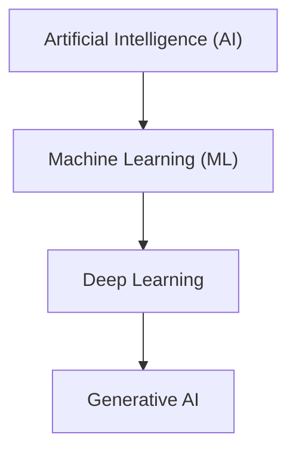

2 — AI, ML, GenAI: put the pieces together
# Mission 2: AI, ML, Deep Learning and Generative AI

## 1. Understanding the Terms

### 1. Artificial Intelligence (AI)

AI is a technology that helps computers perform tasks that normally need human intelligence, such as solving problems, recognising objects and making decisions.

**Example:** A phone's face unlock feature recognises a person's face.

### 2. Machine Learning (ML)

Machine learning is a part of AI in which computers learn patterns from data and use them to make predictions or decisions.

**Example:** An email spam filter learns to identify unwanted emails.

### 3. Deep Learning

Deep learning is a part of machine learning that uses neural networks with many layers to learn complex patterns from large amounts of data.

**Example:** A system that recognises people or objects in photographs.

### 4. Generative AI (GenAI)

Generative AI is a type of AI that can create new content, such as text, images, music or computer code, based on what it has learned.

**Example:** ChatGPT can generate an answer when we ask a question.

## 2. Diagram Showing How They Are Related

The following diagram shows the general relationship between these technologies.

**Note:** This is a simplified diagram. Machine learning is a part of AI, and deep learning is a part of machine learning. Much of today's generative AI uses deep learning, but not all generative AI must use it.

## 3. Checking My Understanding with AI

I asked an AI assistant to explain the diagram in simple words. It explained that AI is the broad field, machine learning is one part of AI, and deep learning is one part of machine learning. It also explained that generative AI creates new content and often uses deep learning.

After checking the explanation, I added a note to the diagram because generative AI does not always have to be shown as a separate level below deep learning. This makes the relationship more accurate.

## Conclusion

I learned that AI is the broad concept, machine learning helps computers learn from data, and deep learning uses layered neural networks to learn complex patterns. Generative AI can create new content, such as text and images. These terms are related, but they do not all mean the same thing.
