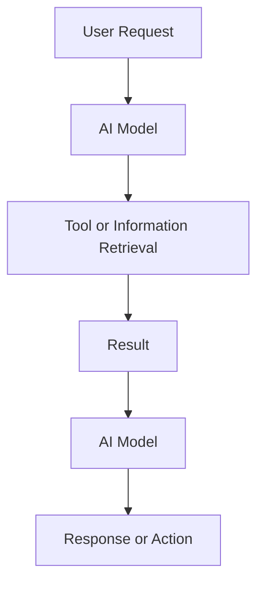

# Mission 6: Chatbot or Agent?

## 1. Understanding the Terms

| Term                                 | Simple Explanation                                                                                               | Example                                                                                    |
| ------------------------------------ | ---------------------------------------------------------------------------------------------------------------- | ------------------------------------------------------------------------------------------ |
| LLM (Large Language Model)           | An AI model that understands and generates text.                                                                 | ChatGPT answering a question.                                                              |
| AI Application                       | A software application that uses AI to perform a task.                                                           | A mobile app that recognises faces.                                                        |
| RAG (Retrieval-Augmented Generation) | A method in which AI retrieves relevant information from documents or other sources before generating an answer. | A chatbot that answers questions using a college handbook.                                 |
| Tool-Using Assistant                 | An AI assistant that can use tools to perform tasks or get information.                                          | An assistant that uses a calculator to solve a maths problem.                              |
| Agent                                | An AI system that can work toward a goal by planning steps, using tools, and checking results.                   | An assistant that finds a suitable train, checks its schedule, and prepares a travel plan. |

## 2. Simple Diagram

The following diagram shows how an AI system can receive a request, use a model and retrieve information or use a tool to produce a response or take an action.

## 3. Everyday Example of an Agentic Workflow

**Example: Planning a Birthday Party**

Suppose I ask an AI assistant to help plan a birthday party.

1. **User:** I ask the assistant to plan a birthday party within my budget.
2. **Model:** The AI understands my request and creates a plan.
3. **Tool or Retrieval:** It checks available venues, prices and food options using suitable tools.
4. **Result:** It compares the available options and selects suitable choices.
5. **Response or Action:** It presents the plan and asks for my approval before making any booking.

This is an example of an agentic workflow because the system works through multiple steps toward a goal and can use tools to complete parts of the task.

## 4. Difference Between a Chatbot and an Agent

A chatbot mainly responds to user messages. An agent can go further by planning steps, retrieving information, using tools and working toward a goal. Depending on its permissions, it may also perform actions.

## 5. Conclusion

I learned that an LLM is the model that generates text, while an AI application uses AI to perform tasks. RAG helps AI answer using retrieved information, and a tool-using assistant can use external tools. An agent can combine these abilities to work toward a goal through multiple steps. Not every chatbot is an agent.

